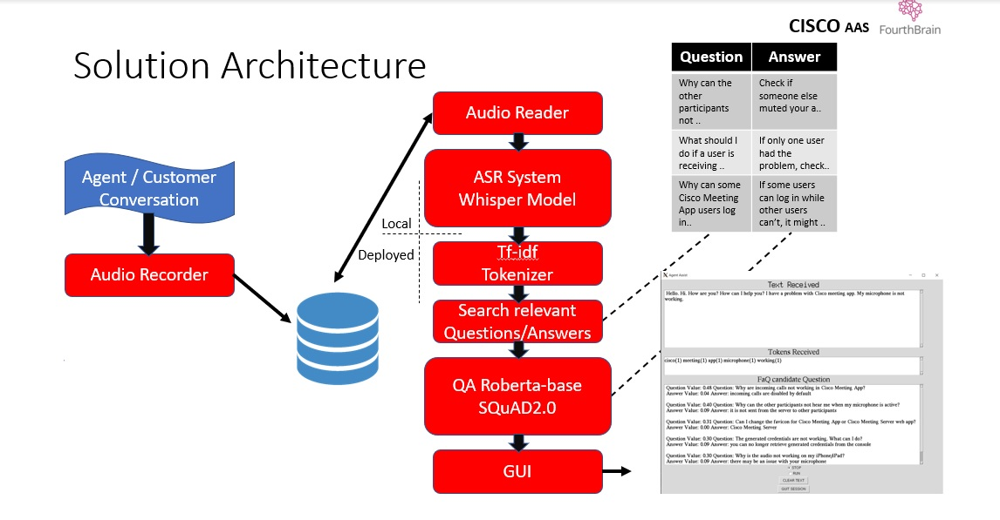
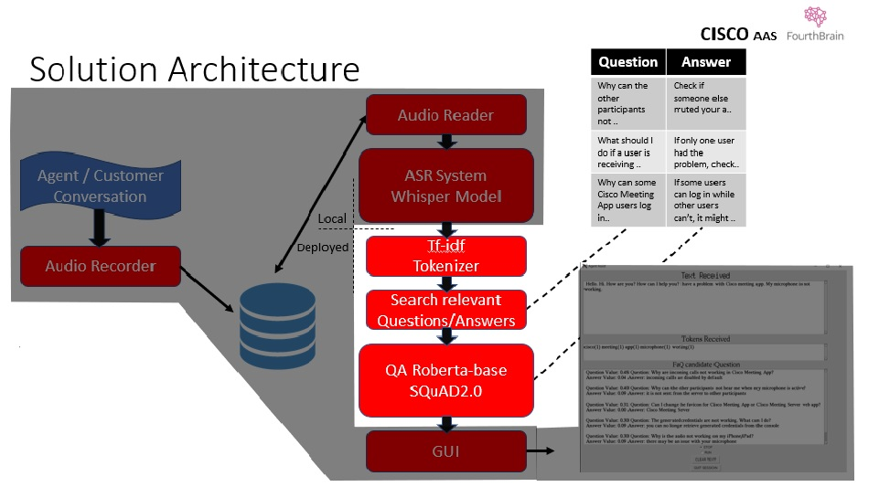

# AgentAssist   (deployed)

AgentAssist Solution is a POC about:

**Helping Organizations achieve a higher level of customer satisfaction**

The Agent Assist Solution provides on the spot technical knowledge related to a conversation that is taking place.
The Customer–Agent dialogue usually starts with greetings and salutations, followed by an optional customer identification and then the actual query.
The assistant listen to the entire conversation, filter the irrelevant content, and presents the pertinent results on the Agent screen, along with confidence scores of each individual result.

## System Architecture
  


### System components     *(this solution comprises two repos)*
Local deployment: Audio Recorder, Audio Reader, ASR System, GUI

Remote deployment: tf-idf Tokenizer, Search engine, RoBERTa for Question Answering

### How it works

The input stage is an audio recorder module that continuously records on local storage the conversation that is taking place.
At the same time, the local ‘Whisper’ model retrieves the audio files and transcribes them,  generating a text with the full content of the conversation.
The full text is fed to a tf-idf tokenizer. Then, the tokens are compared with the FAQ questions tokens using dot product similarity.
The dot product results are ordered by the score value, returning the five most relevant question/answer pairs from the FAQ table.
The Question–Answer Roberta model digests the question and the answer as the context and returns a short answer along with its confidence score.

### AgentAssist (deployed) is the deployed part, please check:

### AgentAssist-speech https://github.com/MitchCosta/AgentAssist-speech for the local part

###

## System Architecture - This Repo
  


Create and activate a virtual environment, use conda or venv

```
conda create --name my_env python=3.8
conda activate my_env

```
Install the required packages

```
pip install -r requirements.txt
```

### FastApi can run locally with:

```
uvicorn main:app --reload --workers 1 --host 0.0.0.0 --port 8000
```

And test FastApi the app and model with:

```
curl \
--header "Content-Type: application/json" \
--request POST \
--data '{"text":"Hello to you. How is the weather in Sydney mate? speaker selection via browser was removed from webRTC app"}' \
http://0.0.0.0:8000/predict
```

### Or containerize it with:

```
docker build -t agent-assist .
```

And run with:

```
docker run -d -p 8000:80 agent-assist
```

And push it to 'docker hub' or just pull the last version with:

```
docker pull mitchcosta/agent-assist-1
```


